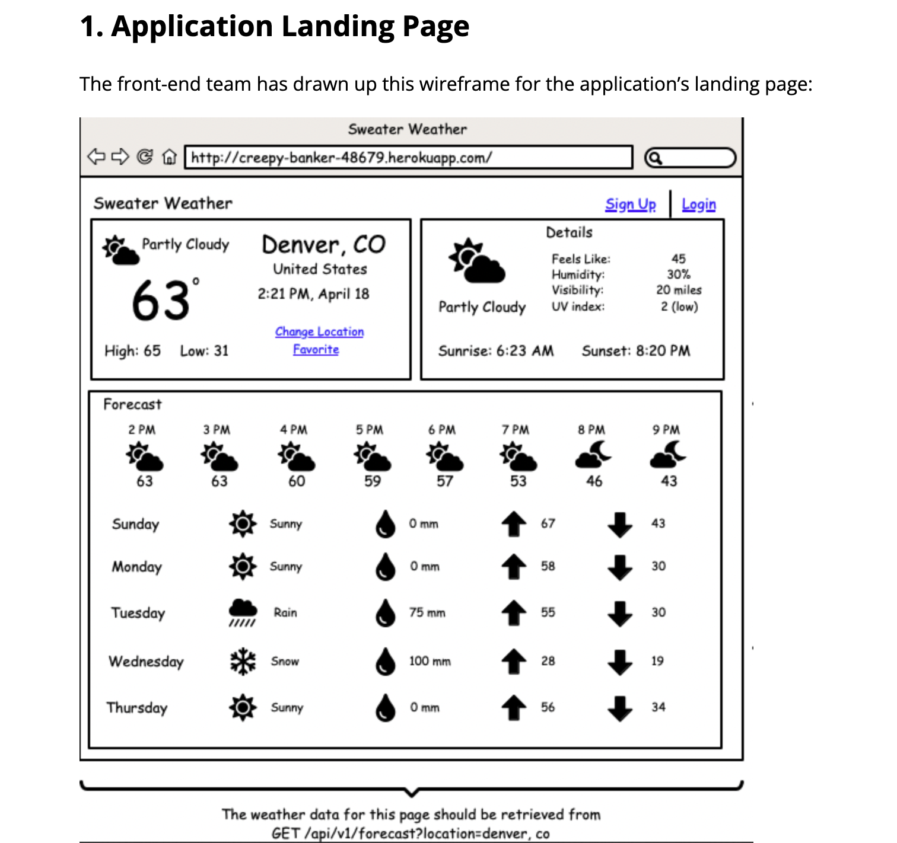

# Sweater Weather

## About the Project

Sweater Weather is a Backend Project that that provides weather information for a specific area. It offers current weather conditions and a five-day forecast, as well as determines the route to a desired destination and the corresponding weather conditions upon arrival. The application integrates with Weather and MapQuest APIs to retrieve data location and weather data. It then creates endpoints in a new API to serialize and send the data to the front-end application.


## Learning Goals
- Expose an API that aggregates data from multiple external APIs
- Expose an API that requires an authentication token
- Expose an API for CRUD functionality
- Determine completion criteria based on the needs of other developers
- Test both API consumption and exposure, making use of the VCR mocking tool


## Versions
- Ruby 3.1.1
- Rails 7.0.4


## API's Used
[MapQuest Api](https://developer.mapquest.com/)
[Weather Api](https://www.weatherapi.com/)


## Setup

1. Fork and Clone the repository
```shell
$ git clone git@github.com:ALHelton/sweater_weather.git
```

2. Navigate to the directory
```shell
$ cd sweater_weather
```

3. Install Gem Packages
```shell
$ `bundle install`
```

4. Update Gem Packages
```shell
$ `bundle update`
```

5. Run the Migrations
```shell
$ rails db:{drop,create,migrate,seed}
```

6. Setup Figaro Gem
```shell
$ bundle exec figaro install
```


## Test Suite Instructions

1. Navigate to each API link and apply for an api key

2. Navigate to `config/application.yml` and add your api keys in the following format:

- ```mapq_key: <YOUR MAPQUEST API KEY HERE>```
- ```wthr_key: <YOUR WEATHER API KEY HERE>```


## Endpoints
<details>
<summary> `GET '/api/v0/forecast?location=#{params}'` </summary>

Params:

<pre>
<code>
$ location=cincinatti,oh
</pre>
</code>




Response:

- Daily forecast: 5 day forecast
- Hourly forecast: Current time thru 7 hours ahead

<pre>
<code>

{
    "data": {
        "id": null,
        "type": "forecast",
        "attributes": {
            "current_weather": {
                "last_updated": "2023-04-26 04:00",
                "temperature": 44.1,
                "feels_like": 42.2,
                "humidity": 89,
                "uvi": 1.0,
                "visibility": 9.0,
                "condition": "Partly cloudy",
                "icon": "//cdn.weatherapi.com/weather/64x64/night/116.png"
            },
            "daily_weather": [
                {
                    "date": "2023-04-26",
                    "sunrise": "06:46 AM",
                    "sunset": "08:25 PM",
                    "max_temp": 61.9,
                    "min_temp": null,
                    "day_condition": "Patchy rain possible",
                    "day_icon": "//cdn.weatherapi.com/weather/64x64/day/176.png"
                },
                {
                    "date": "2023-04-27",
                    "sunrise": "06:45 AM",
                    "sunset": "08:26 PM",
                    "max_temp": 60.6,
                    "min_temp": null,
                    "day_condition": "Heavy rain",
                    "day_icon": "//cdn.weatherapi.com/weather/64x64/day/308.png"
                },
                {
                    "date": "2023-04-28",
                    "sunrise": "06:43 AM",
                    "sunset": "08:27 PM",
                    "max_temp": 66.9,
                    "min_temp": null,
                    "day_condition": "Moderate rain",
                    "day_icon": "//cdn.weatherapi.com/weather/64x64/day/302.png"
                },
                {
                    "date": "2023-04-29",
                    "sunrise": "06:42 AM",
                    "sunset": "08:28 PM",
                    "max_temp": 64.8,
                    "min_temp": null,
                    "day_condition": "Patchy rain possible",
                    "day_icon": "//cdn.weatherapi.com/weather/64x64/day/176.png"
                },
                {
                    "date": "2023-04-30",
                    "sunrise": "06:41 AM",
                    "sunset": "08:29 PM",
                    "max_temp": 64.2,
                    "min_temp": null,
                    "day_condition": "Patchy rain possible",
                    "day_icon": "//cdn.weatherapi.com/weather/64x64/day/176.png"
                }
            ],
            "hourly_weather": [
                {
                    "time": "2023-04-26 12:00",
                    "temperature": 53.2,
                    "conditions": "Overcast",
                    "icon": "//cdn.weatherapi.com/weather/64x64/day/122.png"
                },
                {
                    "time": "2023-04-26 13:00",
                    "temperature": 55.9,
                    "conditions": "Cloudy",
                    "icon": "//cdn.weatherapi.com/weather/64x64/day/119.png"
                },
                {
                    "time": "2023-04-26 14:00",
                    "temperature": 56.8,
                    "conditions": "Overcast",
                    "icon": "//cdn.weatherapi.com/weather/64x64/day/122.png"
                },
                {
                    "time": "2023-04-26 15:00",
                    "temperature": 57.0,
                    "conditions": "Partly cloudy",
                    "icon": "//cdn.weatherapi.com/weather/64x64/day/116.png"
                },
                {
                    "time": "2023-04-26 16:00",
                    "temperature": 59.2,
                    "conditions": "Partly cloudy",
                    "icon": "//cdn.weatherapi.com/weather/64x64/day/116.png"
                },
                {
                    "time": "2023-04-26 17:00",
                    "temperature": 61.9,
                    "conditions": "Sunny",
                    "icon": "//cdn.weatherapi.com/weather/64x64/day/113.png"
                },
                {
                    "time": "2023-04-26 18:00",
                    "temperature": 61.2,
                    "conditions": "Sunny",
                    "icon": "//cdn.weatherapi.com/weather/64x64/day/113.png"
                },
                {
                    "time": "2023-04-26 19:00",
                    "temperature": 59.4,
                    "conditions": "Sunny",
                    "icon": "//cdn.weatherapi.com/weather/64x64/day/113.png"
                }
            ]
        }
    }
}
</pre>
</code>
</details>

